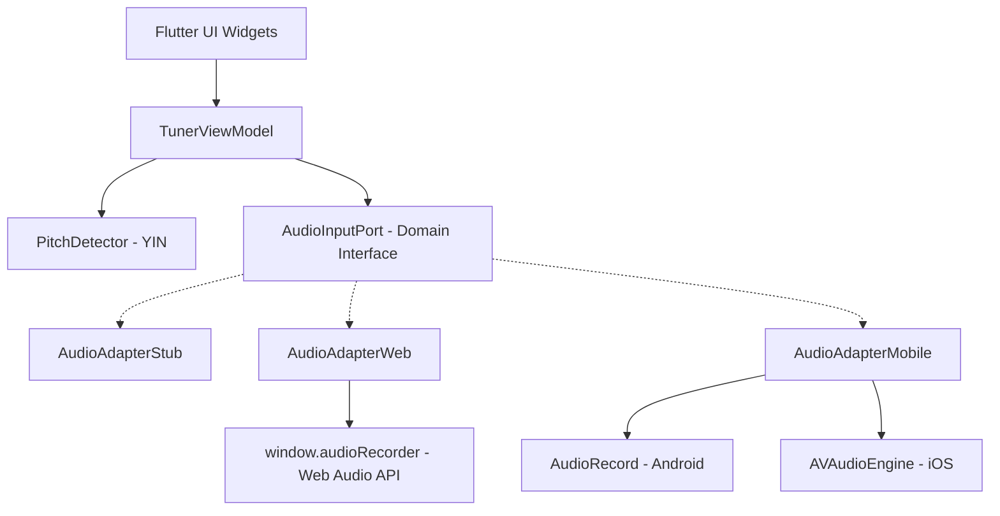

# SleekTuner Architecture & Design

SleekTuner is built using a strict **Layered Hexagonal Architecture** (also known as Ports and Adapters). This architectural pattern decouples the core Digital Signal Processing (DSP) and UI rendering logic from platform-specific hardware details (Web Audio API, Android AudioRecord, iOS AVAudioEngine).

This documentation outlines the directory structure, component boundaries, and data flow of the application.

---

## 1. Project Directory Structure

```text
/TuningVibes
├── /android                   # Native Android application configuration
│   └── /app/src/main/kotlin   # MainActivity.kt (Kotlin AudioRecord stream channel)
├── /ios                       # Native iOS application configuration
│   └── /Runner                # AppDelegate.swift (Swift AVAudioEngine capture tap)
├── /web                       # Web platform assets & configuration
│   └── index.html             # window.audioRecorder (JS AudioContext & ScriptProcessor)
├── /lib                       # Dart & Flutter source code
│   ├── /domain                # Platform-agnostic interfaces & data models
│   │   ├── audio_port.dart    # Abstract AudioInputPort definition
│   │   └── tuner_models.dart  # Note, Tuning, Instrument, TuningState models
│   ├── /dsp                   # Digital Signal Processing calculations
│   │   └── pitch_detector.dart# PitchDetector (YIN Algorithm, Lowpass filter, RMS)
│   ├── /bridge                # Concrete platform channel and JS adapters (The Adapters)
│   │   ├── audio_adapter_stub.dart   # Fallback stub for unsupported platforms
│   │   ├── audio_adapter_web.dart    # JS interop binding using dart:js_interop
│   │   ├── audio_adapter_mobile.dart # MethodChannel/EventChannel mobile binding
│   │   └── native_audio_adapter.dart # Conditional import orchestrator
│   ├── /ui                    # Flutter UI components & widgets
│   │   ├── /widgets           # Waveform, Gauge, Waterfall, and Peg widgets
│   │   ├── /screens           # TunerScreen dashboard
│   │   └── tuner_view_model.dart # State management and DSP orchestration
│   └── main.dart              # Flutter application launcher & theme definitions
├── /test                      # Unit and widget test suite
│   └── widget_test.dart       # smoke test for tuner UI
└── pubspec.yaml               # Flutter project configuration (Zero 3rd-party dependencies)
```

---

## 2. Hexagonal Architecture (Ports & Adapters)

To achieve **zero third-party packages** from `pub.dev` while supporting Web, Android, and iOS, the application uses dependency inversion to bridge Dart and native audio drivers.



### The Port (`lib/domain/audio_port.dart`)
`AudioInputPort` is a platform-agnostic abstract class in the **Domain Layer**. It defines a standard contract:
- Expose a `Stream<List<double>>` of raw normalized audio samples.
- Methods to check and request mic permissions.
- Methods to start and stop the stream.
- A getter `actualSampleRate` to return the real sampling frequency selected by the hardware.

### The Adapters (`lib/bridge/`)
Adapters implement the `AudioInputPort` interface, adapting platform-specific microphone streams into the format required by the domain:
- **Web (`audio_adapter_web.dart`)**: Uses modern `dart:js_interop` to bind JavaScript methods (`audioRecorder.start`, `audioRecorder.stop`) and handle JS arrays. It converts incoming Float32 JS arrays directly into Dart double lists.
- **Mobile (`audio_adapter_mobile.dart`)**: Communicates with native Kotlin and Swift drivers using a standard `MethodChannel` for controls (start/stop) and a high-performance `EventChannel` for streaming flat double arrays back to Dart.
- **Stub (`audio_adapter_stub.dart`)**: Fallback adapter that returns empty streams and default rates. Used to prevent compilation failures during headless unit tests.

### Conditional Compilation (`native_audio_adapter.dart`)
To prevent compiler crashes on mismatched platforms (e.g. referencing `dart:js_interop` on mobile or `dart:io` on web), the factory uses conditional imports:
```dart
import '../domain/audio_port.dart';
import 'audio_adapter_stub.dart'
    if (dart.library.js_interop) 'audio_adapter_web.dart'
    if (dart.library.io) 'audio_adapter_mobile.dart';
```
The Dart compiler selectively loads only the code compatible with the current compilation target.

---

## 3. Real-Time Data Flow

The audio data stream follows a unidirectional, non-blocking pipeline:

1. **Capture**: The physical microphone captures analog pressure waves and converts them to digital PCM buffers.
2. **Platform Capture**:
   - On Web, `onaudioprocess` fires a buffer of Float32 samples.
   - On Android, a background thread polls `AudioRecord.read()` and writes to the EventChannel.
   - On iOS, `AVAudioInputNode.installTap` captures samples.
3. **Bridge Translation**: The native adapter casts incoming buffers into `List<double>` in the range `[-1.0, 1.0]` and pushes them into the `audioStream` sink.
4. **DSP Processing (`TunerViewModel`)**:
   - The stream listener in the ViewModel receives the buffer.
   - The buffer is appended to the rolling waveform history (1024 samples) for background rendering.
   - If an instrument is active, the buffer is processed through an **RC low-pass filter** to discard high harmonics.
   - The filtered buffer is passed to the **YIN Pitch Detector**, which calculates the fundamental frequency (Hz) using the actual stream sample rate.
5. **State Matching**:
   - The view model compares the detected frequency to the selected instrument tuning or the chromatic scale.
   - Cents offset is calculated: $\text{Cents} = 1200 \log_2(f_{\text{detected}} / f_{\text{target}})$.
   - A new `TuningState` is constructed and published to listeners.
6. **UI Refresh**:
   - `TunerScreen` rebuilt via `ListenableBuilder` updates the note readout, level meter, and pegs.
   - The `TunerGauge` needle moves smoothly to the target angle via a `TweenAnimationBuilder` set to 90ms.
   - Custom painters draw the waveform and scrolling spectrogram waterfall.
